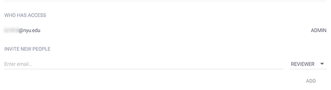
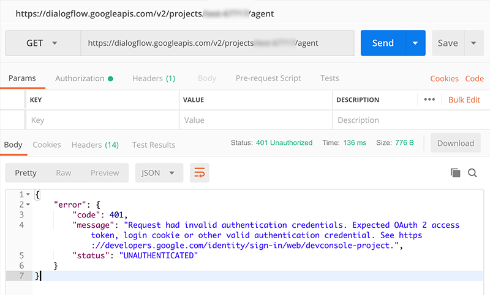
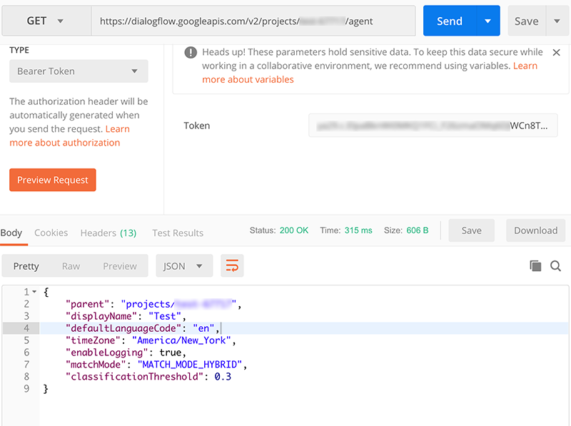
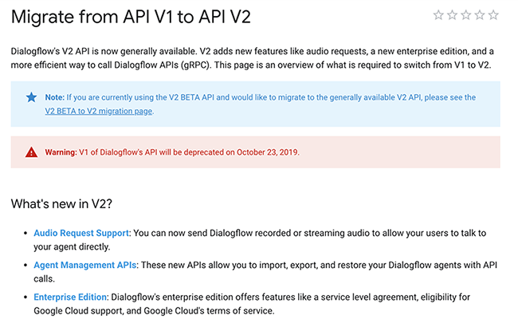
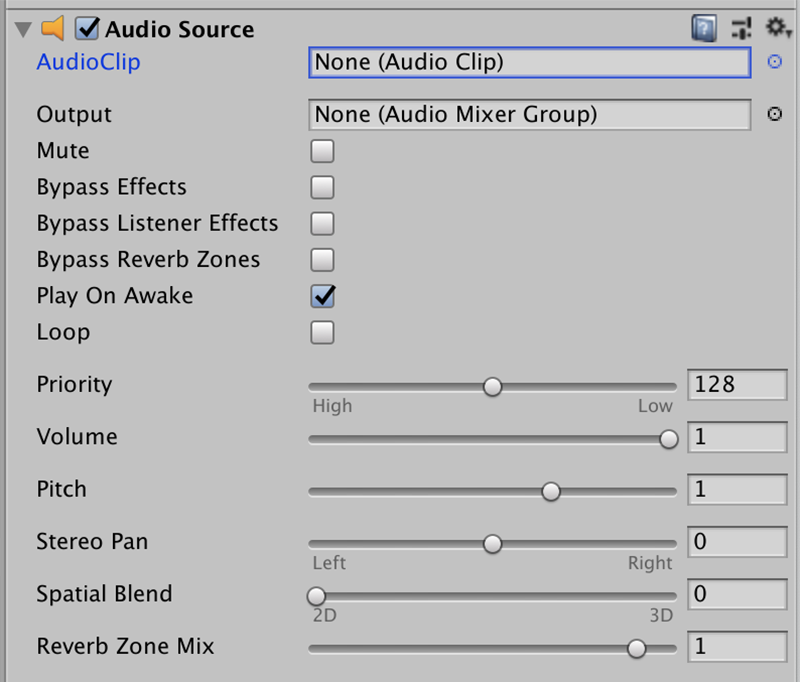
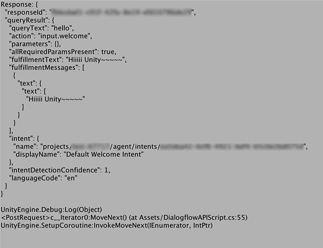

# Dialogflow V2: Unity Plugin Proposal
- [Project Description](#project-description)
- [Team Members](#team-members)
- [Define the problem](#define-the-problem)
- [Address Greater Landscape](#address-greater-landscape)
- [Deliverables](#deliverables)
- [Timeline](#timeline)
- [Documentation](#documentation)
- [Documentation](#documentation)
- [Accessibility](#accessibility)
- [Mentoring](#mentoring)
- [More about team](#more-about-team)
  - [Ilana Pecis Bonder](#ilana-pecis-bonder)
  - [Alice Sun](#alice-sun)
  - [Lin Zhang](#lin-zhang)
- [References](#references)

## Project Description
The Dialogflow V2 Unity Plugin is a continuation from [Api.ai: Unity Plugin](https://github.com/dialogflow/dialogflow-unity-client), which made it easy to integrate the Dialogflow(Api.ai) natural language processing API into your Unity project.

## Team Members
- [Ilana Pecis Bonder](https://github.com/ilanabonder)
- [Alice Sun](https://github.com/alicehgsun)
- [Lin Zhang](https://github.com/linzhangcs)

## Define the problem
- Api.ai: Unity Plugin is no longer working in Dialogflow V2, due to the difference in the way the basic system works ([Dialogflow API v2 versus v1](https://miningbusinessdata.com/dialogflow-api-v2-versus-v1/)).
- Dialogflow API V1 will be shut down in one year – on [October 23rd, 2019](https://plus.google.com/+dialogflow/posts/M6EUgZFhckL).
- Our goal will be figuring out ways to build similar plugin that works in Dialogflow V2 system.

## Address Greater Landscape
Opening new possibilities to involve voice-based conversational interaction in VR and AR environment.

## Deliverables
- Feature: listening and sending voice data from Unity to the Dialogflow V2 service for recognition and processing
- Doc: show and explain how to use it (including STT process, if required)

## Timeline
This project will be completed over 5 weeks (Nov 6 - Dec 11). Describe a timeline in detail below.

### Week 1
- Defining project schedule and make proposal [presentation](https://docs.google.com/presentation/d/1mL3yOky0exaPJceU6yWSf6stgKd8rLB1gd0UZUrA8hg/edit?usp=sharing)
- Reaching out mentors
- Meeting with Nicole @1PM, Nov 8
- Dialogflow V2 Unity Plugin Hackathon Nov 11

### Week 2
- Analyzing the authentication process in Dialogflow V2
  - [Authentication via Google Cloud Service Account JSON key](https://dialogflow.com/docs/reference/v2-auth-setup)
  - It will give 401 error without adding the generated “client_email” in JSON file into the Dialogflow project authentication panel:

<table><tr><td>

</td></tr></table>

<table><tr><td>

</td></tr></table>

  - Adding the “client_email” to "INVITE NEW PEOPLE" will give access to the Dialogflow project:

<table><tr><td>

</td></tr></table>

- [JSON Web Token (JWT)](http://leoncvlt.com/blog/json-web-token-jwt-for-google-cloud-platform-in-unity/) for Google Clout Platform in Unity
- How can we automate this process?

### Week 3
- [Audio Request Support](https://dialogflow.com/docs/reference/api-v2/rest/v2/projects.agent.sessions/detectIntent#QueryInput): Passing audio file directly via V2 API call

<table><tr><td>

</td></tr></table>

- Using [Audio Source](https://docs.unity3d.com/Manual/class-AudioSource.html) in Unity to [capture audio from a microphone](https://github.com/alicehgsun/dialogflow-unity-v2/blob/master/microphoneCapture.cs)

<table><tr><td>

</td></tr></table>

### Week 4

<table><tr><td>

</td></tr></table>

- TBD

### Week 5
- TBD

## Documentation
- The documentation that is more related to detailed process or personal thoughts will be written in individual's blog posts, while information that can be used as instructions or to guide other people will exist inside this project repository for further users and contributors. Initial documentation including basic intro, proposal and schedule will be continuously updated in README.md.

## Accessibility
All documentation will be done with considerations of the [W3C Web Content Accessibility Guide](https://www.w3.org/WAI/standards-guidelines/wcag/).

## Mentoring
- Nicole He: Dialogflow Mentor
- Igal Nassima: Unity Mentor

## More about team

### Ilana Pecis Bonder
- Creative Technologist and UI/UX Specialist
- Interactive Telecommunications Program (ITP)
- [Portfolio](http://www.ilanabonder.com/)
### Alice Sun
- Graphic & interaction designer
- Interactive Telecommunications Program (ITP)
- [Blog](http://www.alicehgsun.com/blog)
### Lin Zhang
- Front-end developer
- Interactive Telecommunications Program (ITP)
- [Blog](https://linzhangcs.github.io/blog/)

## References
- [Api.ai: Unity Plugin](https://github.com/dialogflow/dialogflow-unity-client)
- [Dialogflow API v2 versus v1](https://miningbusinessdata.com/dialogflow-api-v2-versus-v1/)
